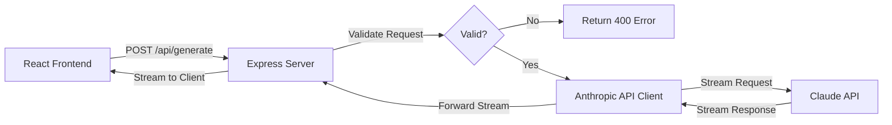
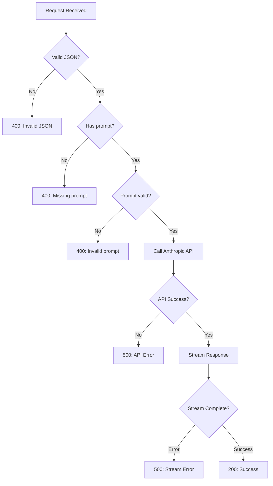

# Design Document

## Overview

The DigitalMe Backend Proxy Service is a lightweight Node.js Express server that provides a secure bridge between the React frontend and the Anthropic Claude API. The service implements a single-endpoint architecture focused on simplicity, security, and real-time streaming capabilities.

### Key Design Principles

- **Security First**: API keys never exposed to the client
- **Minimal Surface Area**: Single endpoint reduces attack vectors and complexity
- **Real-time Experience**: Streaming responses for immediate user feedback
- **Environment-based Configuration**: Flexible deployment across environments
- **Fail-fast Validation**: Early error detection and clear error messages

## Architecture

### High-Level Architecture



### Technology Stack

- **Runtime**: Node.js (LTS version recommended)
- **Framework**: Express.js 4.x
- **HTTP Client**: Anthropic SDK (@anthropic-ai/sdk)
- **Middleware**: 
  - `cors` for cross-origin resource sharing
  - `express.json()` for JSON body parsing
- **Environment Management**: `dotenv` for local development

### Server Lifecycle

1. **Startup Phase**:
   - Load environment variables
   - Validate required configuration (ANTHROPIC_API_KEY)
   - Initialize Express app
   - Configure middleware (CORS, JSON parser)
   - Register routes
   - Start HTTP server on configured port

2. **Request Phase**:
   - Receive POST request at `/api/generate`
   - Validate JSON payload
   - Forward to Anthropic API
   - Stream response back to client

3. **Shutdown Phase**:
   - Graceful connection closure
   - Cleanup resources

## Components and Interfaces

### 1. Server Entry Point (`server.js`)

**Responsibilities**:
- Initialize Express application
- Load and validate environment variables
- Configure middleware stack
- Start HTTP server
- Handle startup errors

**Key Functions**:
```javascript
// Pseudo-code structure
function initializeServer() {
  validateEnvironment();
  const app = createExpressApp();
  configureMiddleware(app);
  registerRoutes(app);
  startServer(app);
}
```

### 2. Environment Configuration Module

**Responsibilities**:
- Load environment variables from `.env` file (development)
- Validate required variables exist
- Provide default values where appropriate
- Export configuration object

**Configuration Schema**:
```javascript
{
  ANTHROPIC_API_KEY: string (required),
  PORT: number (default: 3001),
  FRONTEND_URL: string (default: 'http://localhost:3000'),
  CLAUDE_MODEL: string (default: 'claude-3-5-sonnet-20241022')
}
```

### 3. API Route Handler (`/api/generate`)

**Responsibilities**:
- Validate incoming request payload
- Initialize Anthropic client
- Forward prompt to Claude API
- Stream response chunks to client
- Handle errors gracefully

**Request Interface**:
```javascript
POST /api/generate
Content-Type: application/json

{
  "prompt": string (required, non-empty)
}
```

**Response Interface** (Streaming):
```javascript
Content-Type: text/event-stream
Transfer-Encoding: chunked

// Stream of text chunks as they arrive from Claude
```

**Error Response Interface**:
```javascript
{
  "error": string,
  "message": string
}
```

### 4. Anthropic API Client Wrapper

**Responsibilities**:
- Initialize Anthropic SDK with API key
- Configure streaming parameters
- Handle API-specific errors
- Transform API responses for frontend consumption

**Key Methods**:
```javascript
async function streamCompletion(prompt) {
  // Create streaming request to Anthropic
  // Yield chunks as they arrive
  // Handle completion and errors
}
```

## Data Models

### Request Payload

```javascript
{
  prompt: {
    type: 'string',
    required: true,
    minLength: 1,
    maxLength: 10000, // Reasonable limit
    description: 'User prompt to send to Claude'
  }
}
```

### Environment Configuration

```javascript
{
  ANTHROPIC_API_KEY: {
    type: 'string',
    required: true,
    pattern: /^sk-ant-/,
    description: 'Anthropic API key starting with sk-ant-'
  },
  PORT: {
    type: 'number',
    required: false,
    default: 3001,
    min: 1024,
    max: 65535
  },
  FRONTEND_URL: {
    type: 'string',
    required: false,
    default: 'http://localhost:3000',
    description: 'Allowed CORS origin'
  },
  CLAUDE_MODEL: {
    type: 'string',
    required: false,
    default: 'claude-3-5-sonnet-20241022',
    description: 'Claude model identifier'
  }
}
```

### Error Response Model

```javascript
{
  error: {
    type: 'string',
    enum: ['validation_error', 'api_error', 'server_error'],
    description: 'Error category'
  },
  message: {
    type: 'string',
    description: 'Human-readable error description'
  }
}
```

## Error Handling

### Error Categories

1. **Validation Errors (400)**:
   - Missing prompt field
   - Empty prompt
   - Invalid JSON payload
   - Prompt exceeds maximum length

2. **Server Errors (500)**:
   - Anthropic API failure
   - Network timeout
   - Streaming interruption
   - Unexpected server errors

3. **Configuration Errors (Startup)**:
   - Missing ANTHROPIC_API_KEY
   - Invalid port number
   - Port already in use

### Error Handling Strategy



### Error Response Format

All errors return consistent JSON structure:
```javascript
{
  error: 'error_type',
  message: 'Descriptive error message'
}
```

### Logging Strategy

- **Startup**: Log port and configuration (excluding secrets)
- **Requests**: Log incoming requests with timestamp
- **Errors**: Log full error details (excluding API keys)
- **API Calls**: Log Anthropic API call initiation and completion
- **Never Log**: API keys, full user prompts (only length/metadata)

## Testing Strategy

### Unit Testing

**Target**: Individual functions and modules
**Framework**: Jest
**Coverage Goals**: 80%+ for core logic

**Test Cases**:
1. Environment validation logic
2. Request payload validation
3. Error response formatting
4. Configuration loading with defaults

### Integration Testing

**Target**: API endpoint with mocked Anthropic API
**Framework**: Jest + Supertest

**Test Cases**:
1. POST `/api/generate` with valid prompt returns 200
2. POST `/api/generate` with missing prompt returns 400
3. POST `/api/generate` with empty prompt returns 400
4. POST `/api/generate` with invalid JSON returns 400
5. Anthropic API error returns 500
6. CORS headers present in responses
7. Streaming response delivers chunks correctly

### Manual Testing

**Scenarios**:
1. Start server without ANTHROPIC_API_KEY (should fail)
2. Start server with valid configuration (should succeed)
3. Send request from React frontend (should stream response)
4. Send request from unauthorized origin (should be blocked by CORS)
5. Interrupt streaming mid-response (should handle gracefully)

### Environment Testing

**Environments**:
1. **Local Development**: Using `.env` file
2. **Staging**: Using platform environment variables
3. **Production**: Using platform environment variables with production Claude model

## Security Considerations

### API Key Protection

- Store in environment variables only
- Never log or expose in responses
- Validate format on startup
- Use separate keys for development/production

### CORS Configuration

- Whitelist specific frontend origin
- No wildcard (`*`) origins in production
- Include credentials if needed for future auth

### Input Validation

- Sanitize all user inputs
- Enforce maximum prompt length
- Validate JSON structure before processing
- Reject malformed requests early

### Rate Limiting (Future Enhancement)

- Consider implementing rate limiting per IP
- Prevent abuse of the proxy endpoint
- Protect against DoS attacks

## Deployment Considerations

### Environment Variables

Required `.env` file for local development:
```
ANTHROPIC_API_KEY=sk-ant-xxxxx
PORT=3001
FRONTEND_URL=http://localhost:3000
CLAUDE_MODEL=claude-3-5-sonnet-20241022
```

### Production Checklist

- [ ] Set ANTHROPIC_API_KEY in platform environment
- [ ] Set FRONTEND_URL to production domain
- [ ] Configure PORT if platform requires specific port
- [ ] Enable HTTPS (handled by platform)
- [ ] Set NODE_ENV=production
- [ ] Configure logging for production
- [ ] Set up monitoring and alerts

### Recommended Platforms

- **Heroku**: Simple deployment with environment variables
- **Railway**: Modern platform with easy Express deployment
- **Render**: Free tier available, good for prototypes
- **AWS Elastic Beanstalk**: Enterprise-grade with scaling
- **Vercel/Netlify**: Serverless functions (requires adaptation)

## Performance Considerations

### Streaming Optimization

- Use chunked transfer encoding
- Minimize buffering between Anthropic API and client
- Keep connections alive during streaming
- Set appropriate timeout values

### Resource Management

- Single endpoint reduces memory footprint
- Stateless design enables horizontal scaling
- No database connections to manage
- Minimal middleware stack for fast request processing

### Monitoring Metrics

- Request count per minute
- Average response time
- Error rate by type
- Anthropic API latency
- Active streaming connections
