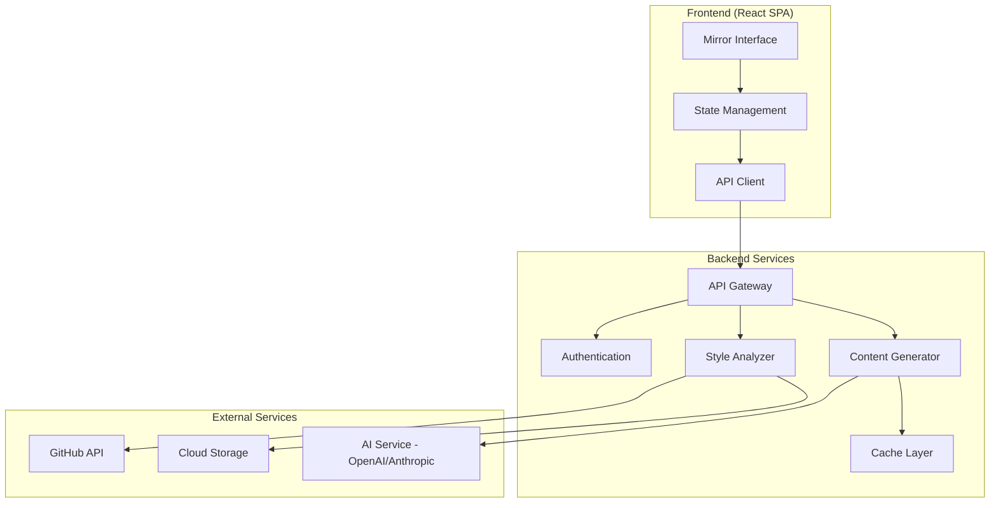
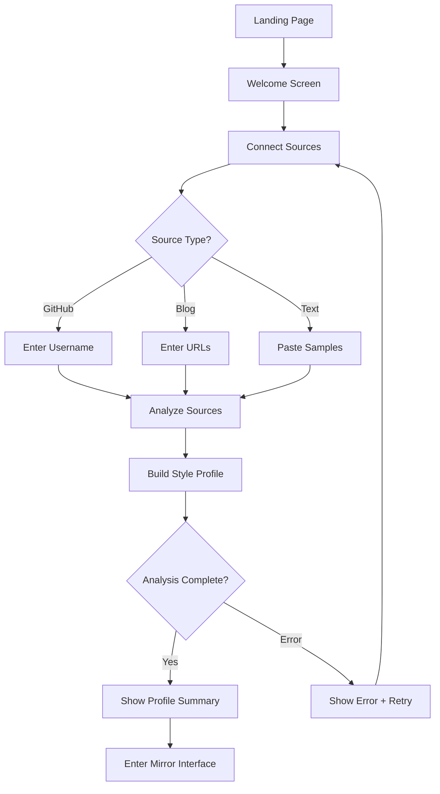
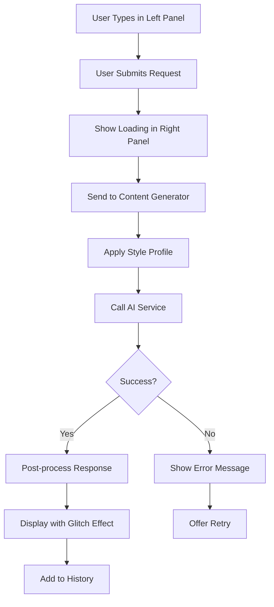
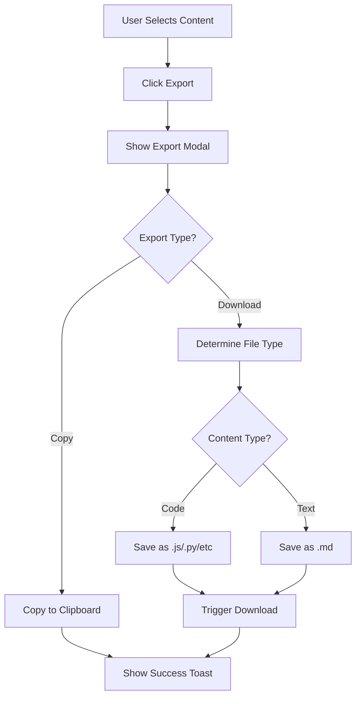

# Design Document

## Overview

DigitalMe.dev is a React-based single-page application that creates an AI-powered digital doppelgänger experience. The system analyzes a user's digital footprint to build a style profile, then generates text and code that mirrors their unique voice. The application emphasizes visual duality through a split-screen mirror interface with dark, futuristic aesthetics.

### Core Design Principles

1. **Mirror Metaphor**: Every interaction reinforces the concept of human-AI duality
2. **Real-time Feedback**: Immediate visual response to user actions
3. **Style Fidelity**: Generated content must authentically reflect user's patterns
4. **Progressive Enhancement**: Start with core functionality, layer in advanced features
5. **Privacy First**: User data remains under their control

## Architecture

### High-Level Architecture



### Technology Stack

**Frontend:**
- React 19.2.0 with functional components and hooks
- CSS Modules for component-scoped styling
- Fetch API for HTTP requests
- LocalStorage for client-side caching

**Backend (Future):**
- Node.js with Express for API gateway
- JWT for authentication
- Redis for caching
- PostgreSQL for user data and style profiles

**AI Integration:**
- OpenAI GPT-4 or Anthropic Claude for text/code generation
- Custom prompt engineering for style matching

**External APIs:**
- GitHub REST API for repository analysis
- Web scraping service for blog content

### Deployment Architecture

**Phase 1 (MVP):** Client-side only with mock data and simulated AI responses
**Phase 2:** Frontend + serverless functions (Vercel/Netlify)
**Phase 3:** Full backend with dedicated services

## Components and Interfaces

### Frontend Component Hierarchy

```
App
├── Header
│   ├── Logo
│   └── Navigation
│       ├── SettingsButton
│       └── ExportButton
├── MirrorInterface
│   ├── LeftPanel (User Input)
│   │   ├── InputArea
│   │   └── MessageHistory
│   └── RightPanel (AI Response)
│       ├── ResponseArea
│       ├── LoadingIndicator
│       └── GlitchEffect
├── OnboardingFlow
│   ├── WelcomeScreen
│   ├── SourceConnector
│   │   ├── GitHubInput
│   │   ├── BlogInput
│   │   └── TextSampleInput
│   └── AnalysisProgress
├── SettingsPanel
│   ├── ProfileSummary
│   ├── SourceManager
│   └── StyleControls
└── ExportModal
    ├── CopyButton
    └── DownloadButton
```

### Key Component Specifications

#### MirrorInterface Component

**Purpose:** Main interaction area with split-screen layout

**Props:**
- `styleProfile`: Object containing analyzed user style data
- `conversationHistory`: Array of message exchanges
- `onSubmit`: Function to handle user input submission

**State:**
- `userInput`: Current text in left panel
- `isGenerating`: Boolean for loading state
- `activePanel`: 'left' | 'right' for focus management

**Behavior:**
- Real-time text display as user types
- Trigger AI generation on submit
- Animate AI response with glitch effect
- Maintain scroll sync between panels

#### StyleAnalyzer Service

**Purpose:** Process digital footprint sources and extract style patterns

**Methods:**
```javascript
analyzeGitHub(username)
  - Fetch public repositories
  - Extract code patterns (naming, structure, comments)
  - Return coding style metrics

analyzeBlog(urls)
  - Fetch and parse blog content
  - Extract writing patterns (tone, vocabulary, sentence structure)
  - Return writing style metrics

buildStyleProfile(sources)
  - Combine all analyzed sources
  - Generate unified style profile
  - Store profile for generation use
```

**Output Format:**
```javascript
{
  coding: {
    language: 'JavaScript',
    framework: 'React',
    componentStyle: 'functional',
    namingConvention: 'camelCase',
    commentFrequency: 'moderate',
    patterns: ['hooks', 'arrow-functions', 'destructuring']
  },
  writing: {
    tone: 'analytical',
    formality: 'formal',
    sentenceLength: 'medium',
    vocabulary: ['technical', 'precise'],
    avoidance: ['emojis', 'slang']
  }
}
```

#### ContentGenerator Service

**Purpose:** Generate text and code using AI with style profile application

**Methods:**
```javascript
generateText(prompt, styleProfile, context)
  - Construct AI prompt with style constraints
  - Call AI service
  - Post-process response for style consistency
  - Return generated text

generateCode(prompt, styleProfile, context)
  - Construct AI prompt with coding conventions
  - Call AI service
  - Format code according to style profile
  - Return generated code with syntax highlighting
```

**Prompt Engineering Strategy:**
- Include style profile characteristics in system prompt
- Provide examples from user's actual content
- Use few-shot learning with user's writing samples
- Apply post-generation filtering for style violations

## Data Models

### User Model

```javascript
{
  id: string,
  email: string,
  createdAt: timestamp,
  lastActive: timestamp,
  styleProfile: StyleProfile,
  sources: Source[],
  preferences: UserPreferences
}
```

### StyleProfile Model

```javascript
{
  id: string,
  userId: string,
  version: number,
  lastUpdated: timestamp,
  coding: CodingStyle,
  writing: WritingStyle,
  confidence: number, // 0-1 score based on data quantity
  sampleCount: {
    codeLines: number,
    textWords: number,
    repositories: number,
    articles: number
  }
}
```

### Source Model

```javascript
{
  id: string,
  userId: string,
  type: 'github' | 'blog' | 'text',
  url: string,
  status: 'pending' | 'analyzing' | 'complete' | 'error',
  addedAt: timestamp,
  lastAnalyzed: timestamp,
  metadata: object
}
```

### Message Model

```javascript
{
  id: string,
  userId: string,
  role: 'user' | 'ai',
  content: string,
  contentType: 'text' | 'code',
  language: string | null, // for code
  timestamp: timestamp,
  feedback: 'positive' | 'negative' | null
}
```

### UserPreferences Model

```javascript
{
  theme: 'dark' | 'light',
  glitchIntensity: 'low' | 'medium' | 'high',
  autoSave: boolean,
  exportFormat: 'markdown' | 'plain',
  notifications: boolean
}
```

## User Interface Design

### Visual Design System

**Color Palette:**
```css
--primary-bg: #0a0a0a;        /* Deep black background */
--secondary-bg: #1a1a1a;      /* Panel backgrounds */
--accent-primary: #00ff41;    /* Matrix green for highlights */
--accent-secondary: #ff0080;  /* Cyberpunk pink for AI responses */
--text-primary: #e0e0e0;      /* Light gray text */
--text-secondary: #808080;    /* Muted gray for secondary text */
--border: #333333;            /* Subtle borders */
--error: #ff3333;             /* Error states */
--success: #00ff41;           /* Success states */
```

**Typography:**
```css
--font-mono: 'Fira Code', 'Consolas', monospace;
--font-sans: 'Inter', 'Segoe UI', sans-serif;
--font-size-base: 16px;
--font-size-large: 20px;
--font-size-small: 14px;
--line-height: 1.6;
```

**Spacing System:**
```css
--space-xs: 4px;
--space-sm: 8px;
--space-md: 16px;
--space-lg: 24px;
--space-xl: 32px;
--space-xxl: 48px;
```

### Layout Specifications

**Mirror Interface Layout:**
```
┌─────────────────────────────────────────────────────┐
│ Header (60px height)                                │
├──────────────────┬──────────────────────────────────┤
│                  │                                  │
│  Left Panel      │  Right Panel                     │
│  (User Input)    │  (AI Response)                   │
│                  │                                  │
│  50% width       │  50% width                       │
│  Full height     │  Full height                     │
│                  │                                  │
│  [Input Area]    │  [Response Area]                 │
│                  │                                  │
│  [History]       │  [History]                       │
│                  │                                  │
└──────────────────┴──────────────────────────────────┘
```

**Responsive Breakpoints:**
- Desktop: > 1024px (split-screen)
- Tablet: 768px - 1024px (split-screen with reduced padding)
- Mobile: < 768px (stacked panels with tab switching)

### Animation Specifications

**Glitch Effect:**
```javascript
// Applied to AI responses on appearance
duration: 300ms
keyframes:
  0%: transform: translate(0)
  20%: transform: translate(-2px, 2px)
  40%: transform: translate(2px, -2px)
  60%: transform: translate(-2px, -2px)
  80%: transform: translate(2px, 2px)
  100%: transform: translate(0)
  
// Color shift overlay
0%: filter: hue-rotate(0deg)
50%: filter: hue-rotate(90deg)
100%: filter: hue-rotate(0deg)
```

**Loading Indicator:**
```javascript
// Pulsing dot animation
duration: 1.5s
iteration: infinite
keyframes:
  0%, 100%: opacity: 0.3
  50%: opacity: 1
```

**Panel Transitions:**
```javascript
// Smooth focus transitions
duration: 200ms
easing: ease-in-out
properties: [border-color, box-shadow]
```

## User Flows

### Onboarding Flow



### Generation Flow



### Export Flow



## Error Handling

### Error Categories and Responses

**Network Errors:**
- Display: "Connection lost. Retrying..."
- Action: Automatic retry with exponential backoff (1s, 2s, 4s)
- Fallback: Show offline mode indicator

**API Errors:**
- 401 Unauthorized: Redirect to login
- 403 Forbidden: "Access denied. Check permissions."
- 404 Not Found: "Resource not found. Verify URL."
- 429 Rate Limited: "Too many requests. Please wait {time}."
- 500 Server Error: "Service temporarily unavailable. Try again."

**Source Analysis Errors:**
- GitHub 404: "GitHub user not found. Check username."
- Blog unreachable: "Cannot access blog. Check URL."
- Parsing failure: "Content format not supported."
- Insufficient data: "Need more content for analysis. Add sources."

**Generation Errors:**
- AI service timeout: "Generation taking longer than expected. Retry?"
- Content filter triggered: "Cannot generate this content. Try different prompt."
- Style profile missing: "Complete onboarding first."

### Error Recovery Strategies

1. **Graceful Degradation**: Continue with partial data when possible
2. **User Guidance**: Provide specific next steps for resolution
3. **Retry Logic**: Automatic retry for transient failures
4. **Fallback Content**: Show cached or example content when live generation fails
5. **Error Logging**: Capture errors for debugging without exposing to user

## Testing Strategy

### Unit Testing

**Components to Test:**
- MirrorInterface: Input handling, state management, rendering
- StyleAnalyzer: Pattern extraction, profile building
- ContentGenerator: Prompt construction, response formatting
- ExportModal: Copy/download functionality

**Testing Approach:**
- Jest for test runner
- React Testing Library for component tests
- Mock external API calls
- Test edge cases and error states

**Coverage Goals:**
- Critical paths: 90%+ coverage
- UI components: 80%+ coverage
- Utility functions: 95%+ coverage

### Integration Testing

**Flows to Test:**
- Complete onboarding flow
- Source connection and analysis
- Content generation end-to-end
- Export functionality
- Settings management

**Testing Approach:**
- Cypress for E2E tests
- Test against mock backend
- Verify visual elements and animations
- Test responsive behavior

### Performance Testing

**Metrics to Monitor:**
- Initial load time: < 2s
- Time to interactive: < 3s
- Generation response time: < 5s
- Animation frame rate: 60fps
- Memory usage: < 100MB

**Testing Tools:**
- Lighthouse for performance audits
- Chrome DevTools for profiling
- Bundle analyzer for code splitting optimization

### Accessibility Testing

**Requirements:**
- WCAG 2.1 Level AA compliance
- Keyboard navigation support
- Screen reader compatibility
- Color contrast ratios: 4.5:1 minimum

**Testing Tools:**
- axe DevTools for automated checks
- Manual keyboard navigation testing
- NVDA/JAWS screen reader testing

## Security Considerations

### Data Privacy

- User content never stored on servers without explicit consent
- Style profiles encrypted at rest
- API keys and tokens stored securely (environment variables)
- No third-party analytics without user opt-in

### Authentication & Authorization

- JWT-based authentication for API requests
- OAuth 2.0 for GitHub integration
- Session timeout after 24 hours of inactivity
- Secure password requirements (future feature)

### Input Validation

- Sanitize all user inputs before processing
- Validate URLs before fetching content
- Limit input length to prevent abuse
- Rate limiting on API endpoints

### Content Security

- Content Security Policy (CSP) headers
- XSS protection through React's built-in escaping
- HTTPS only in production
- Subresource Integrity (SRI) for CDN resources

## Performance Optimization

### Code Splitting

```javascript
// Lazy load non-critical components
const SettingsPanel = lazy(() => import('./SettingsPanel'));
const ExportModal = lazy(() => import('./ExportModal'));
const OnboardingFlow = lazy(() => import('./OnboardingFlow'));
```

### Caching Strategy

**Client-side:**
- Cache style profiles in LocalStorage
- Cache conversation history (last 50 messages)
- Cache user preferences

**Server-side (future):**
- Redis cache for frequently accessed style profiles
- CDN caching for static assets
- API response caching (5-minute TTL)

### Bundle Optimization

- Tree shaking for unused code
- Minification and compression
- Image optimization (WebP format)
- Font subsetting for custom fonts

### Rendering Optimization

- Virtual scrolling for long conversation histories
- Debounce user input (300ms)
- Memoize expensive computations
- Use React.memo for pure components

## Deployment Strategy

### Phase 1: MVP (Client-side Only)

**Features:**
- Mock data for style analysis
- Simulated AI responses
- Full UI implementation
- LocalStorage persistence

**Deployment:**
- Static hosting (Vercel/Netlify)
- No backend required
- Environment: Production

### Phase 2: Backend Integration

**Features:**
- Real GitHub API integration
- AI service integration (OpenAI/Anthropic)
- User authentication
- Cloud storage for profiles

**Deployment:**
- Frontend: Vercel/Netlify
- Backend: Serverless functions or AWS Lambda
- Database: Managed PostgreSQL
- Environment: Staging + Production

### Phase 3: Full Platform

**Features:**
- All requirements implemented
- Scalable infrastructure
- Monitoring and analytics
- CI/CD pipeline

**Deployment:**
- Frontend: CDN distribution
- Backend: Kubernetes or managed containers
- Database: Multi-region PostgreSQL
- Cache: Redis cluster
- Environment: Dev + Staging + Production

## Future Considerations

### Tier 1: Assistant Integrations

**Technical Approach:**
- OAuth flows for Gmail, WhatsApp, Facebook
- Browser extension for message interception
- Real-time suggestion API
- Feedback loop for learning

**Challenges:**
- Platform API limitations
- Real-time performance requirements
- Privacy concerns with message access

### Tier 2: Learning Expansion

**Technical Approach:**
- Chrome/Firefox extension development
- Background script for content collection
- Incremental style profile updates
- Encrypted local storage

**Challenges:**
- Browser security restrictions
- Cross-origin resource sharing
- User privacy and consent management

### Tier 3: Autonomous Agent

**Technical Approach:**
- Webhook integrations for messaging platforms
- Rule engine for response boundaries
- Confidence scoring for autonomous decisions
- Human-in-the-loop for edge cases

**Challenges:**
- Ethical considerations of AI impersonation
- Legal compliance (disclosure requirements)
- Error handling for autonomous actions
- Trust and safety mechanisms
